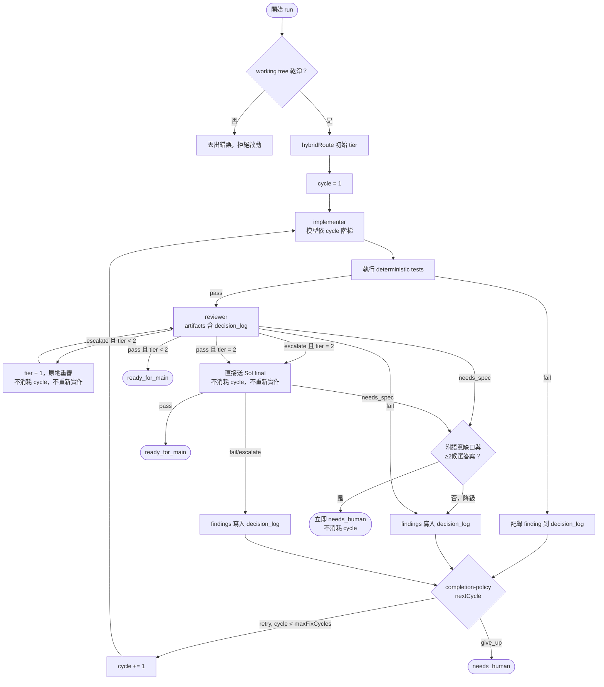

# Orchestrator loop rework：decision log、needs_spec、cycle 語意、prompt 預算

## 背景與目標

一次真實 run（React Native 刪除帳號功能）跑完三輪後回 `needs_human`。根因分析出四個結構性問題：

1. 第三輪 reviewer（Terra）重提第一輪就提過的 SecureStore 疑慮。不是它重複發言，而是它結構上看不到前兩輪的歷史。`reviewer` 收到的 artifacts 每輪重建，只有 `handoff`、`diff`、`tests`、`repo_rules` 四個 key，零筆流程歷史；`implementer` 這邊的 `lastFindings` 也每輪被覆寫，沒有累積紀錄。
2. 真正的缺陷是 handoff 沒定義「backend 刪除成功但 SecureStore 清除失敗」這種狀況的產品語意，但 `ReviewVerdict` 只有 `pass | fail | escalate`，沒有語彙表達「這是 spec 缺口」，reviewer 只能持續回 `fail`，白白燒掉輪次。
3. round 計數硬編碼在 `orchestrator.ts` 五處（`while (round <= 3)` 與四處 `if (round === 3)`），而 `completion-policy.ts` 的 `DEFAULT_MAX_ROUNDS`／`mayRetry` 與整個 `review-loop.ts` 狀態機完全沒有被 `orchestrator.ts` import，是死碼。`docs/architecture.md` 已明確承認這點（第 17 行）；`review-loop.test.ts` 測的是沒人用的狀態機。
4. 成本觀察：Luna 0.004、Terra 合計 0.126、Sol 0.065（單次 run）。目標是把實作盡量留在便宜的 Luna，Terra 只在 review 或 Luna 連續修不好時出場。另外 Luna High 在首次實作時容易過度思考、範圍漂移。

本計畫分五步驟收斂 round 控制、把 review 歷史回流給 agent、開一個「spec 缺口」的合法出口、把 cycle 語意與模型階梯掛勾、並修掉現存的 prompt 無上限膨脹問題。每一步驟可獨立 commit，後面步驟依賴前面步驟，順序不可調換。

討論過程中另外設計過 scope judge 與推定機制，因為缺乏量測資料支持，已移到文末「押後項目」保留脈絡，不納入本次執行範圍。

## 整體流程圖（五個步驟完成後的目標狀態）



短路路徑摘要：
- escalate 且 tier < 2：原地升 tier 重審，不消耗 cycle，不重新實作。
- escalate 且 tier = 2：直接送 Sol final 裁決，不消耗 cycle，不重新實作。
- 任一 reviewer（含 final）回 `needs_spec` 且通過防濫用檢查：立即 `needs_human`，不消耗 cycle。

## 步驟 1：收斂 round 控制到單一 policy

**目的**：先清死碼、建立單一 retry 判斷入口，不改變任何現有行為，作為後續步驟的安全網。

**修改檔案**：
- 刪除 `src/workflows/review-loop.ts`
- 刪除 `src/test/review-loop.test.ts`
- 修改 `src/policies/completion-policy.ts`
- 修改 `src/orchestrator.ts`

**具體改動**：

1. `src/policies/completion-policy.ts` 重寫為唯一的失敗/重試判斷來源：

   ```ts
   export const DEFAULT_MAX_ROUNDS = 3;

   export interface RetryState { round: number; maxRounds: number; }
   export type RetryDecision =
     | { action: "retry"; state: RetryState }
     | { action: "give_up"; state: RetryState };

   export function nextRound(state: RetryState): RetryDecision {
     if (state.round >= state.maxRounds) return { action: "give_up", state };
     return { action: "retry", state: { ...state, round: state.round + 1 } };
   }
   ```

   （此步驟先維持「round」用語與現有語意一致，避免與步驟 4 的 cycle 改名混在同一個 commit 裡；步驟 4 會再改名並擴充。）

2. `src/orchestrator.ts` 的四個失敗分支（測試失敗、reviewer escalate 已達頂即當作 fail、reviewer fail、final fail）改成呼叫 `nextRound({ round, maxRounds })`，`give_up` 時呼叫 `this.finish(..., "needs_human", ...)`，`retry` 時取 `decision.state.round` 更新迴圈變數，`3` 這個數字只留在 `completion-policy.ts` 的 `DEFAULT_MAX_ROUNDS`。
3. `while (round <= 3)` 迴圈條件改成 `while (round <= maxRounds)`，`maxRounds` 在 `run()` 開頭取 `DEFAULT_MAX_ROUNDS`。

   **本步驟刻意不新增任何設定覆寫欄位。** `Handoff` 與 `RepoConfig` 目前都沒有這個欄位，而步驟 4 會把它改名成 `maxFixCycles`；若在此步驟先加 `RepoConfig.maxRounds`，等於同一個欄位在兩個 commit 內改兩次名，還會多一次沒必要的 schema 變動。覆寫欄位統一留到步驟 4，直接用最終名稱 `RepoConfig.maxFixCycles?: number` 加入。

**驗證指令**：
```bash
cd /Users/skai.wu/side/agent-orchestrator && npm test
```

**預期輸出**：全綠，測試數比目前少 4 個（`review-loop.test.ts` 的四個 test 已刪除），`src/test/orchestrator.test.ts` 全部維持通過，不應有任何行為差異（尤其「three review failures require a human」與「a failed tier 2 first round retries implementation with Terra」兩個測試的 round/rounds 數字必須不變）。

---

## 步驟 2：decision log 回流

**目的**：讓每一輪的 finding 累積成一份跨輪次可見的歷史，同時餵給 implementer、reviewer、final_reviewer，解決「reviewer 看不到前兩輪歷史」的核心問題。

**修改檔案**：
- 新增 `src/decision-log.ts`
- 修改 `src/orchestrator.ts`
- 修改 `src/adapters/pi/pi-process-adapter.ts`（`renderPrompt` 的 implementer instruction）
- 新增／修改對應測試：`src/test/orchestrator.test.ts`、新增 `src/test/decision-log.test.ts`

**具體改動**：

1. `src/decision-log.ts` 定義：

   ```ts
   export interface FindingRecord {
     round: number;
     source: "tests" | "reviewer" | "final_reviewer";
     model: string;
     text: string;
     response?: string;
   }
   export interface DecisionLog { findings: FindingRecord[]; }

   export function appendFindings(log: DecisionLog, records: FindingRecord[]): DecisionLog;
   export function formatDecisionLog(log: DecisionLog): string; // 供塞進 prompt artifact 的人類可讀格式
   ```

   `orchestrator.ts` 在每個 run 開頭建立 `let decisionLog: DecisionLog = { findings: [] }`，每次測試失敗／reviewer fail or escalate／final fail 時呼叫 `appendFindings`，並在每個 round 結尾把整份 `decisionLog` 寫到 `root/decisions.json`（累積寫入，非覆寫）。

2. artifacts 擴充：implementer、reviewer、final_reviewer 三者的 `artifacts` 都新增 `decision_log: formatDecisionLog(decisionLog)`（首輪為空字串或明確的「無歷史」字樣）。

3. implementer prompt（`renderPrompt` 中 implementer 分支，或 `orchestrator.ts` 組 prompt 的地方，取決於現有程式碼位置：目前 `renderPrompt` 對非 reviewer/router 一律用同一句「Implement the task...」）新增強制逐條回應規則。改動位置在 `pi-process-adapter.ts`：

   ```ts
   : request.role === "implementer"
     ? [
         "Implement the task, run only safe local checks, and summarize changed files.",
         // scope 硬性條款：預防 Luna 過度思考造成的範圍漂移
         "Do only what the handoff and the listed findings require. Do not refactor, do not reformat, and do not touch files unrelated to the requested change.",
         // 修正輪專用：僅在 decision_log 非空時附加
         "If the artifacts include a decision_log with prior findings: this is an incremental fix, not a rewrite. Do not rewrite the existing implementation. Respond to every prior finding explicitly: state what you changed to address it, or explain why you intentionally left it unchanged.",
       ].join(" ")
     : "Implement the task, run only safe local checks, and summarize changed files."
   ```

   這三句的分工要在實作時保持清楚：第一句是原有指示，第二句是**每輪都套用**的範圍約束（預防），第三句只在有歷史時才有意義（增量修正 + 逐條回應）。

   **這條 prompt 約束是目前唯一的範圍漂移防線。** 押後項目 A 的 scope judge 是它的偵測面，但那要等實際量測到漂移率之後才決定要不要做，所以這幾句 prompt 必須寫好。


4. **不做自動推翻機制**。不新增任何把 finding 標記為「已推翻」的程式邏輯；`FindingRecord.response` 只是原樣記錄 implementer 怎麼說，留給下一個 reviewer 自己判斷。

**驗證指令**：
```bash
cd /Users/skai.wu/side/agent-orchestrator && npm test
```

**預期輸出**：新增的 `decision-log.test.ts` 測 `appendFindings` 累積不覆寫、`formatDecisionLog` 格式穩定。既有 `orchestrator.test.ts` 全綠；至少新增一個測試斷言「三輪失敗後，第三輪 reviewer 收到的 `artifacts.decision_log` 包含第一輪與第二輪的 finding 文字」，驗證回流真的生效。

---

## 步驟 3：`needs_spec` verdict 出口（最小版）

**目的**：讓 reviewer 有語彙表達「這不是實作錯誤，是 handoff 沒定義的產品語意」，避免無意義地重複 fail 燒輪次，並讓這個結果帶著具體問題回到討論階段。

**範圍限制**：本步驟只做 verdict、防濫用檢查、寫回 spec 三件事。原先設計過的三層自主收斂與推定機制已移到文末「押後項目」，等實際 run 的資料再決定要不要做。

**修改檔案**：
- 修改 `src/agents/contracts.ts`
- 修改 `src/adapters/pi/pi-process-adapter.ts`
- 修改 `src/orchestrator.ts`
- 修改 `src/spec.ts`（讓 `needs_spec` 的缺口與候選答案寫回「未決事項」章節）
- 修改 `src/cli.ts`（spec status 寫回時帶上缺口內容）

**具體改動**：

1. `src/agents/contracts.ts`：
   ```ts
   export type ReviewVerdict = "pass" | "fail" | "escalate" | "needs_spec";
   ```

2. `pi-process-adapter.ts`：
   - `normalizeVerdict` 新增 case：
     ```ts
     case "needs_spec": case "spec_gap": case "needs_clarification": return "needs_spec";
     ```
   - `parseReview` 的回傳型別需要一併帶出 `needs_spec` 時的候選答案與缺口描述。輕量做法：沿用既有 `findings` 陣列本身承載這些內容（reviewer 被要求用 findings 的第一條寫缺口描述，其餘條目寫候選答案），不新增額外欄位到 `AgentRunResult`，避免動到 contract 太多；在 `orchestrator.ts` 端做「至少 3 條 findings（1 缺口描述 + ≥2 候選）」的防濫用檢查。
   - `renderPrompt` 的 reviewInstruction 為 reviewer/final_reviewer 分支新增說明：
     ```text
     If the defect you found is that the correct behavior is undefined in the handoff, such that any implementation choice could be wrong, respond with VERDICT: needs_spec instead of VERDICT: fail. When you do, your findings must include: (1) exactly what semantic is undefined, and (2) at least two concrete candidate answers for what it should do.
     ```

3. `orchestrator.ts`：reviewer／final_reviewer verdict 為 `needs_spec` 時：
   - 防濫用檢查：`findings.length < 3`（缺口描述 + 至少兩個候選）時，**降級為 `fail`** 走原本的重試路徑（不當作 needs_spec）。
   - 通過檢查則呼叫 `this.finish(root, "needs_human", ...)`，**不呼叫 `nextRound`，不消耗輪次**，並在 `finish()` 產出的 `summary.md` 額外寫出缺的是哪條語意（第一條 finding）與候選答案（其餘 findings）。這需要小幅擴充 `finish()` 的簽名，新增可選參數例如 `extra?: { specGap: string; candidates: string[] }`，或是在呼叫端直接把這些內容併入既有 `RunOutcome`／`summary.md` 寫法（避免動 `RunOutcome` 對外型別，優先選擇只擴充 `summary.md` 內容，`RunOutcome` 保持不變）。

4. **`needs_spec` 是回到討論階段的那條邊，不是終點。** 目前 `src/cli.ts` 在 `needs_human` 時把 spec status 設為 `needs_clarification`，但不帶任何內容。改為同時把缺口與候選答案寫回 spec 的「未決事項」章節，讓下次任一 agent（Claude Code 或 Pi）打開這份 spec 就直接看到要問使用者什麼。整體形狀是一個閉合循環：

   ```
        ┌──────────────────────────────────────┐
        ▼                                      │
   討論階段（Claude Code 或 Pi，人在哪就在哪）   │
        │                                 needs_spec
   spec: approved                    缺的語意 + 候選答案
   unresolvedItems: []                       │
        ▼                                      │
   實作階段（orchestrator）───────────────────┘
        │
        ▼
   ready_for_main
   ```

   **兩個階段不合併成同一個 agent，統一的是 spec 格式本身。** 討論階段的價值來自累積的脈絡（知識庫、前幾輪決策、專案記憶），那綁在「使用者人在哪討論」，不綁在哪個 agent。`loadSpec` 定義的 frontmatter 加八個章節已經是兩邊共用的契約，這就是正確的耦合點；合併 agent 反而會把使用者綁死在單一入口。

**驗證指令**：
```bash
cd /Users/skai.wu/side/agent-orchestrator && npm test
```

**預期輸出**：新增測試：(a) reviewer 回 `needs_spec` 且 findings 足夠時，`outcome.status === "needs_human"` 且 `outcome.rounds` 等於觸發時的輪次（未 +1，即未消耗輪次），且 `summary.md` 內容包含 spec gap 描述；(b) reviewer 回 `needs_spec` 但 findings 只有 1 條時，行為等同 `fail`（消耗一輪，若非最後一輪則繼續下一輪 implementer）；(c) `needs_spec` 時 spec 的「未決事項」章節被寫入缺口與候選答案，status 為 `needs_clarification`。

---

## 步驟 4：cycle 語意改寫 + Luna 模型階梯

**目的**：把「round」重新定義為「cycle」（一次完整的 implement→judge→test→review→final），並讓模型選擇只看 cycle 數，達成「實作盡量留在 Luna」的成本目標。

**修改檔案**：
- 修改 `src/orchestrator.ts`（迴圈變數改名、ledger 檔名改名、escalate-at-tier-2 分支改為不消耗 cycle）
- 修改 `src/policies/completion-policy.ts`（`RetryState`/`nextRound` 改名為 cycle 語意，或新增別名並淘汰舊名，視是否有其他呼叫端而定；本檔僅 orchestrator 使用，可直接改名）
- 修改 `src/models.ts`（`modelFor` 的 implementer 階梯改為純 cycle 導向）
- 修改 `src/routing.ts`（不動；tier 仍只升不降，僅影響 reviewer 是誰，本步驟需確認 `modelFor` 呼叫端傳入的是 cycle 而非 tier 相依的 round）
- 修改 `src/handoff.ts`（`RepoConfig` 新增可選欄位 `maxFixCycles?: number`）
- 修改 `src/cli.ts`（`result.rounds` → `result.cycles`，並修掉硬編碼的 `/3` 分母）
- 修改對應測試：`src/test/orchestrator.test.ts`、`src/test/routing.test.ts`

**具體改動**：

1. `completion-policy.ts`：`RetryState.round` → `RetryState.cycle`，`nextRound` → `nextCycle`（維持相同邏輯，只改名），`DEFAULT_MAX_ROUNDS` → `DEFAULT_MAX_FIX_CYCLES = 3`（語意：最多 3 次「因失敗而重新實作」，即最多 4 次實作）。

   ```ts
   export const DEFAULT_MAX_FIX_CYCLES = 3;
   export interface CycleState { cycle: number; maxFixCycles: number; }
   export type CycleDecision =
     | { action: "retry"; state: CycleState }
     | { action: "give_up"; state: CycleState };
   export function nextCycle(state: CycleState): CycleDecision {
     if (state.cycle > state.maxFixCycles) return { action: "give_up", state };
     return { action: "retry", state: { ...state, cycle: state.cycle + 1 } };
   }
   ```

   `RepoConfig` 同時新增可選欄位 `maxFixCycles?: number`（不擴充 `Handoff` 本身，因為 handoff schema 文件已定案，覆寫走 repo 設定較不易誤用），`run()` 開頭以它覆寫預設值。

   注意上限改成 `cycle > maxFixCycles` 才 give_up（而非 `>=`），因為語意變成「第 4 次實作即 cycle 4，此時已經用掉 3 次 fix」。呼叫端需要對齊：**失敗計數點在失敗當下，不在進入時**，即 cycle 4 的實作仍會完整跑完 tests、reviewer、必要時 Sol final，只有在 cycle 4 又失敗時才呼叫 `nextCycle` 判斷 `give_up`。

2. `orchestrator.ts`：
   - 迴圈變數 `round` 全面改名為 `cycle`；`while (round <= 3)` 改為 `while (cycle <= maxFixCycles + 1)`（4 次實作對應 cycle 1~4）。
   - ledger 檔名 `round-N-*` 改成 `cycle-N-*`（`round-${round}-implementer` → `cycle-${cycle}-implementer`，其餘同理）。
   - `RunOutcome.rounds` 欄位改名為 `RunOutcome.cycles`（型別上是 breaking change，需同步檢查 `src/cli.ts`、`extensions/orchestrate.ts` 有沒有讀取 `outcome.rounds`，若有一併改名）。
   - `escalate` 分支：目前 `if (verdict === "escalate" && effective.tier < 2)` 原地升 tier 重審不消耗輪次（維持不變）；`if (verdict === "escalate")`（即 tier 已經是 2）**改為不再走 fail 路徑**，而是直接送 Sol final review（等同原本 tier===2 pass 後才做的那段），不呼叫 `nextCycle`，不重新實作。若 Sol final 仍不通過才記一次 finding 並呼叫 `nextCycle`。
   - implementer 呼叫改為 `model: modelFor(effective.tier, "implementer", cycle)`，`modelFor` 第三參數語意從「round」改為「cycle」（見下）。

3. `src/models.ts` 的 `modelFor` implementer 階梯改寫，只看 cycle，不看 tier：

   ```ts
   export function modelFor(tier: Tier, role: AgentRole, cycle = 1): ModelSelection {
     if (role === "router") return classifierModel();
     if (role === "implementer") {
       if (cycle === 1) return codex("luna", "medium");
       if (cycle === 2 || cycle === 3) return codex("luna", "high");
       return codex("terra", "medium"); // cycle 4
     }
     if (tier === 0) return codex("luna", "low");
     if (tier === 1) return role === "reviewer" ? codex("luna", "high") : codex("sol", "low");
     if (role === "reviewer") return codex("terra", "medium");
     return codex("sol", "medium");
   }
   ```

   **注意 tier 1 的 final_reviewer 分支必須保留。** 原始 `modelFor` 的 tier 1 分支是「implementer 或 reviewer 用 Luna High，其餘（即 final_reviewer）用 Sol Low」。把 implementer 抽出去之後，如果 tier 1 直接寫成 `return codex("luna", "high")`，tier 1 的 final_reviewer 會從 Sol Low 悄悄變成 Luna High。實務上 `orchestrator.ts` 只在 `tier === 2` 呼叫 final_reviewer，所以跑不到，但 `modelFor` 是對外函式，`docs/modules/routing.md` 的 model matrix 也記載這一格，不可無意變更。

3b. **必須同步修正的既有測試斷言**（漏改會被誤判為迴歸）：

   `src/test/orchestrator.test.ts`：
   - 「tier 1 finishes after the isolated Luna review」：implementer 斷言目前是 `luna high`，改為 `luna medium`。
   - 「a failed tier 2 first round retries implementation with Terra」：cycle 1 從 `luna high` 改為 `luna medium`；cycle 2 因為是「第一次修正」是 `luna high` 而**不是** terra；terra 要到 cycle 4 才出現。這個測試的名稱與意圖都要跟著改寫。

   `src/test/routing.test.ts`（原計畫遺漏，此檔有六行 `modelFor` 斷言，其中三行會失敗）：
   - `modelFor(1, "implementer")`：`luna high` → `luna medium`
   - `modelFor(2, "implementer", 1)`：`luna high` → `luna medium`
   - `modelFor(2, "implementer", 2)`：`terra medium` → `luna high`
   - 另外三行（`modelFor(0, ...)` 兩行與 `modelFor(2, "final_reviewer")`）不受影響，應維持通過，可當作「沒有誤傷其他格」的驗證。
   - 建議補一行 `modelFor(1, "final_reviewer")` 期待 `sol low` 的斷言，把上面那個容易漏掉的分支釘住。

3c. **`src/cli.ts:24` 的硬編碼分母**：

   ```ts
   console.log(`\n${result.status.toUpperCase()} · Tier ${result.tier} · ${result.rounds}/3 rounds · run ${result.runId}`);
   ```

   這裡除了 `result.rounds` → `result.cycles` 的改名之外，分母 `/3` 也是寫死的。改成 4 次實作後會印出錯誤的分母，必須一併改成引用實際上限（`maxFixCycles + 1`）並把字樣從 `rounds` 改為 `cycles`。此處為目前唯一讀取 `outcome.rounds` 的呼叫端，`extensions/orchestrate.ts` 經確認並未讀取此欄位。

   reviewer 的模型維持依 tier 決定（不看 cycle），與現況、`docs/modules/routing.md` 的 model matrix 精神一致，只是 implementer 那一列改變。

4. tier 升級規則不變：「只升不降，升級不消耗 cycle」。

**驗證指令**：
```bash
cd /Users/skai.wu/side/agent-orchestrator && npm test && npx tsc --noEmit
```

**預期輸出**：`npm test` 全綠（含更新後的 `orchestrator.test.ts` 與 `routing.test.ts` 模型階梯斷言）；新增測試涵蓋：(a) cycle 1→2→3→4 的 implementer 模型依序為 luna medium / luna high / luna high / terra medium；(b) tier 2 escalate 時直接送 final review 且不消耗 cycle（`outcome.cycles` 應等於觸發時的 cycle，不 +1）；(c) `RunOutcome.cycles` 型別存在，`rounds` 已移除；(d) `modelFor(1, "final_reviewer")` 仍為 sol low（防止 tier 1 分支被改壞）。`npx tsc --noEmit` 無型別錯誤（`src/cli.ts:24` 的 `result.rounds` 與 `/3` 分母必定會被抓出，需一併修正）。

---

## 步驟 5：prompt 長度預算與顯式截斷

**目的**：修掉現存 bug（非新功能引入）：`workingDiff()` 對 untracked 檔案用 `git diff --no-index /dev/null <file>` 會把整個檔案內容原封不動印出來；`renderPrompt` 與呼叫端把所有 artifacts 直接字串串接，全程沒有任何長度上限；`repo_rules` 是整份 `CLAUDE.md`；`decision_log` 會隨 cycle 增長。這些疊加起來會讓新功能（通常帶一批新檔案）的 prompt 無限膨脹。

**修改檔案**：
- 新增 `src/prompt-budget.ts`
- 修改 `src/adapters/pi/pi-process-adapter.ts`（`renderPrompt`）
- 修改 `src/orchestrator.ts`（若有需要對個別 artifact 先行截斷，或全部交給 `renderPrompt` 統一處理）
- 修改 `src/handoff.ts`（`RepoConfig` 新增可選的預算覆寫欄位，例如 `promptBudget?: Partial<Record<string, number>>`）
- 新增測試 `src/test/prompt-budget.test.ts`

**具體改動**：

1. `src/prompt-budget.ts`：
   ```ts
   /** 字元數，非 token 數；避免在未實測前寫死任何模型的 context window 數字。 */
   export interface PromptBudget { perArtifactChars: number; totalChars: number; }

   /** 待實測調整：目前為保守預設值，未對照任何特定模型的實際上限。 */
   export const DEFAULT_PROMPT_BUDGET: PromptBudget = { perArtifactChars: 20_000, totalChars: 80_000 };

   export function truncate(text: string, maxChars: number, marker = "…[TRUNCATED, see ledger for full content]…"): string {
     if (text.length <= maxChars) return text;
     const head = Math.floor((maxChars - marker.length) * 0.7);
     const tail = maxChars - marker.length - head;
     return `${text.slice(0, head)}\n${marker}\n${text.slice(text.length - tail)}`;
   }

   export function applyBudget(artifacts: Record<string, string>, budget: PromptBudget): Record<string, string> {
     const truncated: Record<string, string> = {};
     for (const [key, value] of Object.entries(artifacts)) truncated[key] = truncate(value, budget.perArtifactChars);
     const total = Object.values(truncated).join("").length;
     if (total <= budget.totalChars) return truncated;
     // 超出整體預算時，依比例再次縮減每個 artifact（不含 marker 已計入的部分不重複截斷）
     const ratio = budget.totalChars / total;
     const rebalanced: Record<string, string> = {};
     for (const [key, value] of Object.entries(truncated)) rebalanced[key] = truncate(value, Math.floor(value.length * ratio));
     return rebalanced;
   }
   ```

2. `pi-process-adapter.ts` 的 `renderPrompt`：在組 `artifacts` 字串前，呼叫 `applyBudget(request.artifacts, budget)`，`budget` 來源優先序：`request` 沒有帶預算欄位（`AgentRunRequest` 不擴充，避免動 contract），改在 `PiProcessAdapter` 建構子接受可選 `PromptBudget`，預設用 `DEFAULT_PROMPT_BUDGET`；`Orchestrator` 建構時可從 `RepoConfig.promptBudget` 組出 `PromptBudget` 傳給 adapter 建構子（此處需要在 `src/cli.ts` 或 `Orchestrator` 內完成組裝，具體以現有 DI 方式為準：`OrchestratorDependencies` 目前用 `agents: AgentRunner` 介面注入，adapter 的建構在 CLI 層，因此預算覆寫實際生效點在 CLI 組裝 `PiProcessAdapter` 時，而非 `Orchestrator` 內部）。

3. `workingDiff()` 中對 untracked 檔案的處理維持組出完整內容（截斷交給下游 `renderPrompt` 統一處理，不在 `orchestrator.ts` 提前截斷，避免 ledger 裡的 diff 也被截斷，違反「完整內容一律留在 ledger」的原則）。

4. `repo_rules`（CLAUDE.md 全文）與 `decision_log`（隨 cycle 增長）都走同一個 `applyBudget`，不特殊處理。

**驗證指令**：
```bash
cd /Users/skai.wu/side/agent-orchestrator && npm test
```

**預期輸出**：新增測試涵蓋：(a) `truncate` 對短字串原樣回傳；(b) `truncate` 對超長字串回傳含 marker 的頭尾拼接，長度不超過 `maxChars`；(c) `applyBudget` 對多個 artifacts 總長超過 `totalChars` 時等比例再縮減；(d) `orchestrator.test.ts` 新增一個整合測試：塞入一個超大 untracked 檔案，驗證 `agents.calls` 中傳給 implementer/reviewer 的 `artifacts.diff` 觸發截斷後，實際送進 Pi 的 prompt 長度受 `totalChars` 限制。

**完整內容的保存位置要寫對。** `orchestrator.ts` 寫的 `cycle-N-implementer.json` 存的是 `AgentRunResult`（`summary`／`verdict`／`findings`／`events`／`usage`），**沒有 `diff` 欄位**，不能拿它斷言未截斷內容。未截斷的 artifacts 實際留存於 `PiProcessAdapter` 寫出的 `<sessionDir>/request.json`，因為它寫的是 `{ ...request, prompt }`：`prompt` 是截斷後的算繪結果，但展開的 `request.artifacts` 仍是原件。測試要斷言「完整內容仍可追溯」時，對象是這個檔案。

實作時要確保這個性質成立：`applyBudget` 只能作用在 `renderPrompt` 產出的字串上，**不可原地改寫 `request.artifacts`**，否則 `request.json` 也會一起被截斷，「完整內容一律留在 ledger」的前提就不成立了。這點建議直接寫成一個測試。

---

## 需要同步更新的文件

依 `CLAUDE.md` 維護原則（程式碼行為、tier/model 對照、handoff schema 變更時同步更新對應 docs），本計畫執行完六步驟後需要更新：

- **`docs/modules/orchestration.md`**：
  - Round 改名為 cycle，改寫「每個 cycle」流程圖文字。
  - 改寫「Round 計數」為「Cycle 計數」，寫明「失敗計數點在失敗當下，不在進入時」與 `maxFixCycles = 3` 對應最多 4 次實作。
  - 新增 `needs_spec` 出口的完成狀態說明（不消耗 cycle、防濫用檢查、summary.md 內容）。
  - 新增 decision log 的角色與寫入規則（tests/reviewer/final fail 進 decision log）。
  - Ledger 目錄結構圖檔名從 `round-N-*` 改成 `cycle-N-*`，新增 `decisions.json`。

- **`docs/modules/routing.md`**：
  - Model matrix 表格改寫：implementer 只看 cycle（1: Luna Medium、2/3: Luna High、4: Terra Medium），reviewer 仍看 tier。
  - Review escalation 一節改寫「Tier 2 reviewer 仍回 escalate」的行為：從「視為失敗」改成「直接送 Sol final 裁決，不消耗 cycle，不重新實作」。
  - 新增 `needs_spec` 的路由說明（不算 escalate，不算 fail，是獨立終止路徑）。

- **`docs/modules/pi-adapter.md`**：
  - 輸出解析一節新增 `needs_spec`／`spec_gap`／`needs_clarification` 的 verdict 正規化。
  - 新增「Prompt 長度預算」一節，說明 `applyBudget`／`truncate` 的截斷標記與預設值（標注「待實測調整」），並說明 ledger 保留完整內容、只有送進 Pi 的 prompt 被截斷。

- **`docs/architecture.md`**：
  - 分層表格刪除「`src/workflows/review-loop.ts` 與 `src/policies/completion-policy.ts` 保留一套純狀態機...沒有呼叫該狀態機」這段描述（因為 `review-loop.ts` 已刪除，`completion-policy.ts` 已成為唯一來源且被實際呼叫）。
  - Ledger 目錄結構同步改成 cycle 命名，新增 `decisions.json`。

- **`CLAUDE.md`**（agent-orchestrator 專案根目錄）：
  - 模組清單若有新增檔案路徑（`src/decision-log.ts`、`src/prompt-budget.ts`）需要補進「模組」表格對應的 Orchestration 或新增一列。
  - 若 `docs/modules/` 底下新增任何檔案（例如把 decision log 拆成獨立文件而非塞進現有三份），需要在「文件導航」表格加一列。

---

## 風險與未決事項

1. **截斷預設值待實測**：`DEFAULT_PROMPT_BUDGET`（`perArtifactChars: 20_000, totalChars: 80_000`）是保守猜測值，未對照任何模型實際 context window 或實測 prompt 效果調整。上線後應觀察：(a) 是否有 reviewer 因為看不到關鍵 diff 內容而誤判；(b) 實際 prompt 長度分佈，據此調整預算或改成按 artifact 類型分別配置（例如 diff 應該比 repo_rules 拿到更多預算）。

2. **範圍漂移目前只靠 prompt 約束把關，沒有偵測機制**：步驟 2 的 scope 條款是預防，沒有任何東西會在 implementer 真的漂移時攔下來，只能靠後續 reviewer 察覺。這是刻意的取捨（見押後項目 A）。上線後要量測的具體指標是：reviewer findings 中屬於「改了不該改的東西」的比例。若這個比例偏高，再撿回 scope judge。

3. **允許 4 次實作後的成本變化需要實測驗證**：步驟 4 把 implementer 最多從 3 輪次擴大到 4 次（cycle 1~4）。首次實作改用 Luna Medium（比原本 Luna High 便宜）能抵銷部分增量，但最壞情況的總呼叫次數仍增加，需要用真實 run 重新量測總成本（背景中「Luna 0.004、Terra 合計 0.126、Sol 0.065」是舊流程的單次數字，改版後需要重新記錄同一類任務的成本，確認「盡量留在 Luna」的目標有沒有實際達成）。

4. **`needs_spec` 防濫用檢查偏簡化**：步驟 3 用「findings 數量 ≥ 3」當防濫用門檻，這是形式檢查，無法保證第一條真的是「語意缺口描述」、其餘真的是「候選答案」而非灌水湊數。若觀察到 reviewer 用湊數的方式繞過 fail 走 needs_spec 提早結束，需要加強為結構化 JSON 輸出（例如 `{ verdict, specGap, candidates: string[] }`）並在 `parseReview` 層驗證欄位型別，而非目前借用 `findings` 陣列的寬鬆做法。

5. **`RunOutcome.rounds` → `cycles` 屬於破壞性型別變更**：步驟 4 需要找出所有讀取 `outcome.rounds` 的呼叫端（`src/cli.ts`、`extensions/orchestrate.ts` 等）一併修正，計畫執行時務必先跑 `npx tsc --noEmit` 抓出遺漏點，不能只靠 `npm test` 的測試覆蓋範圍。

6. **implementer prompt 的 scope 條款可能與合理擴散衝突**：步驟 2 加入的「不動無關檔案」是硬性措辭，但實務上修正 finding 常需要動到相鄰檔案（這正是我們放棄純機械 drift guard 的原因）。措辭上已用「unrelated to the requested change」而非「不在 scope.include 內」來保留判斷空間，但仍需觀察 implementer 會不會因為這句話而過度保守、該改的不敢改，反而讓 reviewer 重複提同一個 finding。這與風險 2 是方向相反的失敗模式，兩邊都要看。

---

## 押後項目（有設計，等資料再決定要不要做）

這些是討論過程中設計出來、但**目前沒有量測資料支持**的機制。保留設計脈絡，不納入本次執行範圍。

判斷準則：接下來要做的東西，應該是下一次真實 run 告訴我們需要的，不是現在想像出來的。步驟 1 到 5 做完就有可跑的版本，跑幾次自然會知道下列機制需不需要、以及需要哪一種。

一個實用的警訊：當開始需要設計「某機制的例外處理的例外處理」時，通常代表該機制還不該存在。

### 押後 A：scope judge

**押後理由**：目前只有「感覺 Luna High 會偏移」的印象，沒有量測。步驟 2 已加入 implementer 的 prompt scope 條款（不重構、不改格式、不動無關檔案），那幾乎是零成本的預防。應先出那個版本，量測實際範圍漂移率，再決定是否需要額外的 agent 呼叫來偵測。

<details>
<summary>原始設計（展開）</summary>

**原步驟 5：scope judge**

**目的**：在 implement 之後、tests 之前插入一個唯讀 agent，判斷這輪改動是否偏離 handoff／findings 授權的範圍，取代原本考慮過的機械式 drift guard（純檔案集合比對無法區分合理擴散與漂移，故改用機械證據 + agent 裁決的組合）。

**修改檔案**：
- 修改 `src/agents/contracts.ts`（`AgentRole` 新增 `"scope_judge"`）
- 修改 `src/adapters/pi/pi-process-adapter.ts`（`toolsFor`、`renderPrompt` 的 scope_judge 分支、verdict 解析）
- 修改 `src/models.ts`（`modelFor` 新增 scope_judge 分支，固定 Luna Medium）
- 修改 `src/orchestrator.ts`（插入 judge 呼叫、`out_of_scope_files` 計算、踢回邏輯、ledger/decision log 寫入規則）
- 修改 `src/test/orchestrator.test.ts`

**具體改動**：

1. `contracts.ts`：`AgentRole` 加 `"scope_judge"`；`ReviewVerdict` 不動（judge 用獨立的判斷值，不是 review 語意），新增判斷輸出型別，或沿用 `AgentRunResult.verdict` 承載 `justified | drift`（需在 `pi-process-adapter.ts` 的 `normalizeVerdict` 或新的 `normalizeScopeVerdict` 中處理，避免污染 reviewer 的 `pass/fail/escalate/needs_spec` 詞彙表）。建議新增獨立函式 `parseScopeJudgement(text): { verdict: "justified" | "drift" | undefined; reason: string; citedClause?: string }`，與 `parseReview` 分開，因為判決語彙、結構化要求（必須指出對應 handoff 條款或 finding 編號）都不同。

2. `pi-process-adapter.ts`：
   - `toolsFor`：`scope_judge` 比照 reviewer/final_reviewer，回傳 `"read,grep,find,ls"`。
   - `renderPrompt`：新增 `scope_judge` 分支的 instruction，要求輸出結構化判決（例如 `VERDICT: justified` 或 `VERDICT: drift`），且 `justified` 必須在 findings/文字中指出對應的 handoff 條款（例如 `scope.include` 中的路徑）或 finding 編號，講不出來就必須判 `drift`。

3. `models.ts`：`modelFor` 新增：
   ```ts
   if (role === "scope_judge") return codex("luna", "medium");
   ```
   固定不隨 tier 變，維持在既有的 `if (role === "router") ...` 之後、implementer 分支之前插入。

4. `orchestrator.ts`：插入位置在 `workingDiff()` 取得 diff 之後、`runTests()` 之前（也在 `hybridRoute` 重新判斷 tier 之後或之前皆可，建議放在 tests 前、routing 判斷後，因為 judge 需要看到本輪 diff）。

   - 計算 `out_of_scope_files`：本輪改到的檔案（從 `git diff --name-only` 取得，需要新增一個輔助函式，例如 `changedFiles(repo): Promise<string[]>`）減去「上一輪改過的檔案」∪「findings 裡點名的檔案」。首次實作（cycle 1）沒有 `previous_diff`，改用 `handoff.scope.include` 當範圍基準。
   - **比對基準在 cycle 開始時凍結。** 同一個 cycle 內因 drift 被踢回、implementer 重新實作之後，`out_of_scope_files` 仍以**踢回前那份基準**比對，不可改用剛剛被判 drift 的那一版當新基準。否則 implementer 可以靠連續多次小步擴張把範圍撐開，每次都「只比上一次多一點點」，judge 每次都判 justified。實作時要把這個理由寫成程式碼註解。
   - judge 的 artifacts：`handoff`、`decision_log`、`findings`（本輪要修的 findings，即 `lastFindings`／decision log 最新一批）、`previous_diff`（上一輪 diff 全文，若有）、`diff`（本輪 diff_stat，用 `git diff --stat`）、`implementer_rationale`（implementer 該輪 `result.summary`）、`out_of_scope_files`（清單）、`out_of_scope_diff`（僅 `out_of_scope_files` 那幾個檔案的完整 diff，用既有 `git diff -- <file>` 逐檔取得後拼接）。**不給完整 diff**，judge 有 read/grep 可自行查。
   - 判決：
     - `justified` → 理由（含引用的 handoff 條款或 finding 編號）寫入 decision log（`source: "scope_judge"`），繼續往下跑 tests。
     - `drift` 且本 cycle 尚未踢回過：踢回同一 implementer，重新呼叫 implementer（同一 `cycle`，不遞增），prompt 附上判定理由與該回退的檔案清單；**只寫 ledger（`cycle-N-scope-judge-1.json` 等），不進 decision log**。用一個 per-cycle 計數器（例如 `scopeRejections` in-loop 變數，每個 cycle 開始時歸零）追蹤是否已踢回過。
     - `drift` 且本 cycle 已踢回過一次：判定為這個 cycle 的一次失敗，走 `nextCycle`（等同 reviewer fail 路徑），不再重試 judge。
     - 解析失敗或 timeout（`parseScopeJudgement` 回傳 `verdict === undefined`，或呼叫本身拋出 timeout error）：**fail-open**，放行並記錄（ledger 寫入判決失敗的原因，決策繼續往下跑 tests，不阻塞流程）。

**驗證指令**：
```bash
cd /Users/skai.wu/side/agent-orchestrator && npm test
```

**預期輸出**：新增測試涵蓋：(a) judge 回 `justified` 時繼續跑 tests，decision log 有新增一筆 `source: "scope_judge"` 紀錄；(b) judge 第一次回 `drift` 時踢回同一 implementer、cycle 數不變、decision log 未新增紀錄（只有 ledger 檔案）；(c) 第二次仍 `drift` 時計為一次 cycle 失敗，呼叫 `nextCycle`；(d) judge verdict 無法解析時 fail-open，流程仍執行到 tests。

---


</details>

### 押後 B：三層自主收斂與推定機制

**押後理由**：這是為「一句話隨手分派」這個**尚未存在的工作流**預先蓋的基礎設施。目前只有一次真實 run 的資料，那次的病是 reviewer 看不到歷史、以及 spec 缺口沒有出口，兩者已由步驟 2 與步驟 3 直接處理。推定機制另有兩個問題：它與 decision log 高度重疊（推定本質上是 decision log 中一筆 `source: "presumption"` 的紀錄，真正新增的只有程式碼註解），而且複雜度已超過它要解決的問題（五個條件、四個通知位置、生命週期管理、三向稽核分流）。

等 dev-flow 實際跑過幾次，看「AI 擅自決定產品語意」是否真的高頻發生，再回頭決定要做哪一部分。

<details>
<summary>原始設計（展開）</summary>

**原步驟 3 擴充版：三層自主收斂**

**目的**：讓 reviewer 有語彙表達「這不是實作錯誤，是 handoff 沒定義的產品語意」，避免無意義地重複 fail 燒輪次；同時把「必須打斷使用者」的次數壓到最低。

**設計原則：只有產品語意決策該停下來問人**

使用者的目標是「AI 自行跑完循環，不需介入」，但這不能靠讓 AI 猜產品語意達成，那正是本次燒掉三輪的原因。界線是：

| 缺口類型 | 誰決定 |
|:---|:---|
| 產品降級語意（SecureStore 清除失敗時下次啟動算不算已登出） | 只有使用者。選 A 或 B 都能實作，但選錯就是錯的產品 |
| 實作手段（要不要加 startup session 驗證） | AI 自行決定 |
| 測試命令、要改哪些檔案、UI 細節 | AI 自行決定，不得詢問 |

因此 `needs_spec` 不是單一出口，而是三層由自動到人工的收斂：

**第一層：先查已記錄的決策。** 遇到缺口時先翻該 repo 的 `decisions.md` 與既有 spec。同類問題在第二個專案再遇到時不該再問使用者一次。這是最大的自動化槓桿，且會隨使用愈來愈自動。

**第二層：查不到就推定，標記後繼續跑。** 依同 repo 既有慣例自行決定，把決定與理由登記為推定，流程繼續，不打斷使用者。

**第三層：真正的新產品決策才停。** 停下來時必須是選擇題而非開放討論（`needs_spec` 強制附「缺的語意 + 至少兩個候選答案」），使用者回一個字母即可。

**推定的邊界（五個條件全中才可推定）**

1. **可逆**：不產生資料遺失、不動外部狀態、改回成本接近零
2. **不在不可逆清單**：auth、刪除、金流、對外發布、DB schema。這五類直接跳第三層。判定用機械規則掛在 `RepoConfig.riskPaths`，不由模型自行判斷
3. **有先例**：同 repo 既有慣例或 `decisions.md` 有記錄。完全沒有先例者屬新產品決策，跳第三層
4. **不改變驗收條件**：若推定會改變「什麼叫做完」，一律跳第三層。這是可推定與不可推定之間最乾淨的界線，改手段可以，改目標不行
5. **不疊加**：單次 run 推定上限 3 條。超過代表 spec 本質太模糊，整份退回討論階段

**推定通知：四個位置都要寫**

通知必須落在除錯的人會經過的地方，只寫在一份沒人開的報告裡等於沒寫。

| 位置 | 為什麼 |
|:---|:---|
| `summary.md` 開頭的「本輪推定」區塊 | 交付當下看得到 |
| spec 新增「本輪推定」章節 | 兩個 agent 共用的介面，下次討論看得到 |
| `.agent/in-flight.md` 該列標記 `ready_for_main (2 推定)` | 隨口問進度時看得到 |
| **程式碼內一行註解，含穩定標記與 run id** | 三個月後 debug 到那行時看得到 |

程式碼註解格式（只有影響 runtime 行為的推定才加，純結構性的不加，避免雜訊）：

```ts
// PRESUMPTION[2026-08-02T...-a1b2c3d4] SecureStore 清除失敗時採 best-effort 語意；
// 先例：同 repo logout 流程；可逆；未改變驗收條件。
```

**推定的生命週期：必須是會排空的佇列，不是只增不減的日誌**

若推定只累積不消失，三個月後 repo 內散落數十條註解，等同沒記。四個機制讓它收斂：

1. **穩定標記可 grep**：`PRESUMPTION[` 前綴，一個 grep 撈出全 repo 未結案推定
2. **兩種結案**：確認正確則升級寫入 `decisions.md` 並移除註解；確認錯誤則修掉。兩者都讓推定消失
3. **自動重新浮現（關鍵機制）**：orchestrator 每次 run 時，掃出「本次要動的檔案裡既有的 `PRESUMPTION[` 註解」，當成 artifact 餵給 implementer 與 reviewer。下次改到該區域時，舊推定自動回到眼前被確認或修掉，不依賴使用者記得去掃
4. **升級後餵回第一層**：進了 `decisions.md` 的推定，下次同類問題直接命中已記錄決策，不需再推定

**執行保證**

推定由 implementer 提出，但**由 reviewer 稽核**：reviewer 檢查清單新增一條，發現 diff 內有未登記的推定即判 `fail`。不依賴 implementer 自律，而是讓既有的 review 順便擋住。


5. **推定機制**（`src/presumptions.ts` 與 orchestrator 整合）：
   - `scanPresumptions(repo, files): Promise<Presumption[]>`：grep `PRESUMPTION[` 前綴，解析 run id 與說明。
   - orchestrator 在組 implementer/reviewer artifacts 時新增 `open_presumptions`，內容是**本次要動的檔案**裡既有的推定（不是全 repo，避免雜訊）。這是讓推定佇列自動排空的關鍵機制。
   - implementer prompt 新增：允許在符合五個條件時推定，但必須同時寫入程式碼註解與回報清單；不符合條件時必須改回 `needs_spec` 路徑。
   - reviewer prompt 新增稽核條款：diff 內若有未登記的推定，判 `fail`。
   - 單次 run 推定超過 3 條時，orchestrator 直接收斂為 `needs_human`，理由寫明「spec 過於模糊」。


**稽核違規的三向分流**

reviewer 發現未登記推定時依違規性質分流，不可一律判 `fail`（用昂貴的修正循環處理事務性問題不成比例）：

1. **未登記但推定本身合規** → 踢回同一 implementer 補登記，不消耗 cycle，上限 1 次。補登記是純加法的機械修正，沒有設計風險。
2. **未登記且根本不該推定**（踩到不可逆清單、改變驗收條件、超過上限）→ 直接 `needs_spec` 停下來問人。踢回無用，implementer 重做只會再做一次同樣判斷。這一類是最有價值的攔截。
3. **reviewer 判斷不出來** → 當一般 finding 走正常 fail 路徑。

**推定的定義必須卡死**

兩個條件必須同時成立才算推定：handoff 與 spec 對這件事**真的沒寫**，且這個選擇**在產品行為上看得出來**。變數命名、要不要抽 helper、迴圈寫法都不是推定。沒有這個界線，reviewer 會把整份 diff 標成推定，通知量爆炸後使用者就會開始忽略通知，回到「一多就落掉」的原點。

</details>
