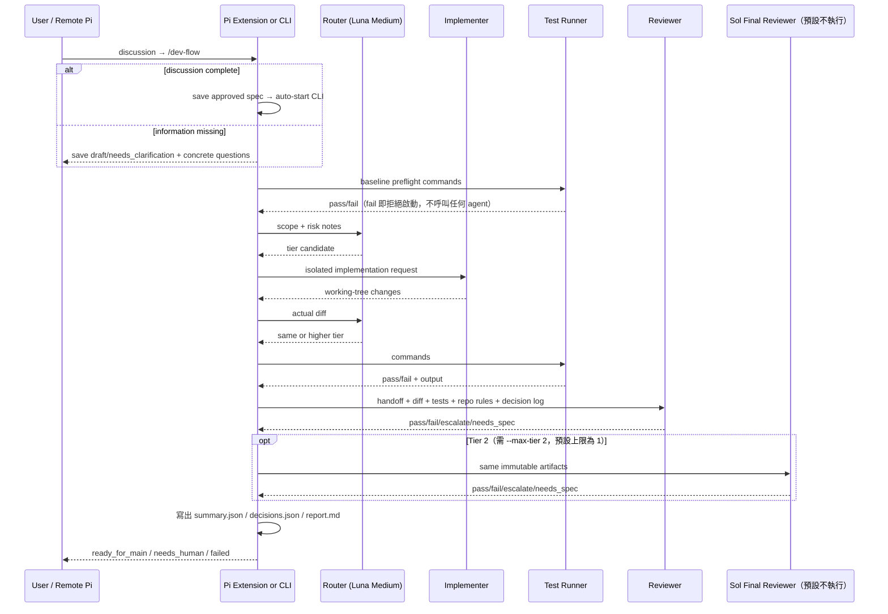

# 系統架構

本文件忠實描述目前程式分層、呼叫關係與資料保存方式。

## 分層

| 層級 | 檔案 | 責任 |
|:---|:---|:---|
| Entry | `src/cli.ts` | 載入 handoff、建立 Pi adapter/classifier、啟動流程 |
| Mobile entry | `extensions/orchestrate.ts` | 註冊 spec tool、`/dev-flow`、`/dev` 與 `/orchestrate`，非同步啟動 CLI |
| Domain | `src/spec.ts`、`src/handoff.ts`、`src/agents/contracts.ts` | Spec lifecycle、輸入與 agent request/result 型別 |
| Routing | `src/routing.ts`、`src/models.ts`、`src/classifier-prompt.ts` | deterministic floor、model classifier 合併、模型選擇 |
| Workflow | `src/orchestrator.ts` | cycle、升級、測試、review 與完成條件 |
| Adapter | `src/adapters/pi/pi-process-adapter.ts` | Pi child process、工具權限、JSONL 與 verdict 解析 |
| Execution | `src/test-runner.ts` | 依序執行 deterministic shell commands |

`src/policies/completion-policy.ts` 是「失敗後是否重試」的唯一判斷來源。`src/orchestrator.ts` 的失敗分支（測試失敗、reviewer fail、降級的 needs_spec、final reviewer fail）一律呼叫 `nextCycle`，上限只允許出現在該檔案的 `DEFAULT_MAX_FIX_CYCLES`。相同失敗連續出現兩個 cycle 時，`nextCycle` 之前先熔斷。

## 執行序列

這張圖回答：**每個角色收到哪些 artifact、以及隔離邊界在哪**。`E` 永遠在中間，agent 之間沒有任何箭頭，這是不可弱化的性質。

分支條件、什麼會消耗 cycle、各種終局怎麼來的，見 `docs/modules/orchestration.md` 的流程圖。改分支動那張，改 artifact 或角色動這張。




## Isolation 邊界

- 每次 agent invocation 建立不同 `sessionDir`。
- Router 使用 `--no-tools`。
- Reviewer 與 final reviewer 只開啟 `read,grep,find,ls`。
- Implementer 開啟 `read,write,edit,bash,grep,find,ls`。
- 所有 child process 使用 `--no-extensions`，避免載入 Remote Pi 或專案 extension。
- Reviewer 只接收 handoff、最終 diff、測試輸出與根目錄 `CLAUDE.md`，不接收 implementer conversation。

## GitHub queue boundary

```text
ChatGPT/repo → approved Issue → human dev-flow-ready → one Mac poll
  → atomic GitHub claim ref → ready→running label transition → allowlisted checkout/worktree
  → existing Luna-first orchestrator → ready_for_main + tests/reviews
  → codex branch → commit/push → Draft PR → human/ChatGPT review
```

`GhCliAdapter` uses `gh` argv and structured JSON for reads; Issue text is passed as an argv value, never interpolated into a shell command. The worker records a local queue ledger before external work. Non-success outcomes before publication do not push. If an error happens after push, the worker attempts to delete the remote branch; cleanup failure is recorded and returned as `needs_human` rather than being hidden. No merge or deployment is performed. Full lifecycle: `docs/modules/github-issue-queue.md`.

## Ledger

```text
<target-repo>/.orchestrator/
├── router-<timestamp>/
└── runs/<run-id>/
    ├── run.json
    ├── cycle-<n>-implementer.json
    ├── cycle-<n>-tests.json
    ├── cycle-<n>-reviewer.json
    ├── cycle-<n>-final.json       # Tier 2 才有
    ├── spec.md                    # 執行當下的 spec 快照（spec 會被就地改寫）
    ├── decisions.json             # 跨 cycle 累積的 findings 與 implementer 回應
    ├── preflight-tests.json       # baseline 預檢結果
    ├── report.md                  # 人類可讀報告（決定性渲染）
    ├── cycle-<n>.diff             # 該 cycle 的完整 diff，第一級檔案
    ├── cycle-<n>-router/          # classifier session，歸屬於本次 run
    ├── summary.json
    └── summary.md
```

Ledger 透過 `git rev-parse --git-path info/exclude` 加入 `.orchestrator/`，可處理一般 repo 與 linked worktree。
