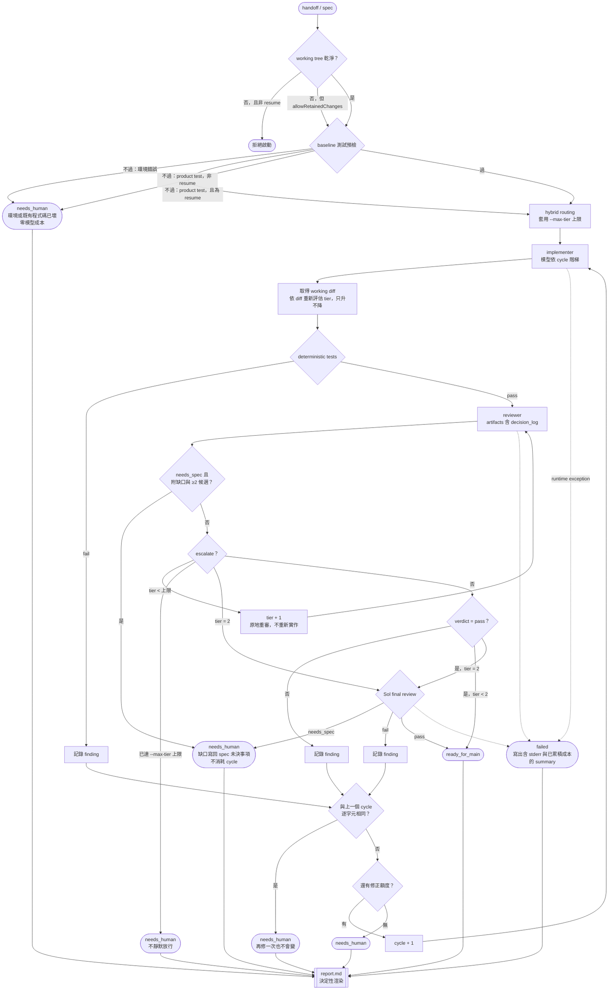

# Orchestration 模組

本文件說明 `Orchestrator.run()` 的前置條件、cycle 行為與完成狀態。

## 前置條件

1. 目標必須是 Git repo。
2. `.orchestrator/` 先加入 repo-local Git exclude。
3. 除 `.agent/specs/` 外，`git status --porcelain` 必須為空；其他 dirty working tree 直接拒絕啟動。**例外**：`RunSource.allowRetainedChanges` 為 `true` 時放行，這是 queue resume 專用，且只有在 queue 已驗過 retained worktree provenance 之後才會設定。
4. baseline 記錄目前 `HEAD`；implementer 若改變 HEAD，流程丟出錯誤。
5. 基礎測試命令必須在乾淨的 baseline 上通過（見下方「預檢」）。resume 對這條有條件放寬，同見該節。

## 每個 cycle

一個 cycle 是一次完整的 implement → tests → reviewer →（tier 2）final。

這張圖回答：**什麼條件下分岔、什麼會消耗 cycle、各種終局怎麼來的**。每個角色實際收到哪些 artifact、以及隔離邊界，見 `docs/architecture.md` 的執行序列圖。



不消耗 cycle 的路徑：tier escalation、合格的 `needs_spec`、tier 2 的 escalate 交由 Sol 裁決。

## Cycle 計數

`maxFixCycles` 計的是「因失敗而重新實作」的次數，預設 3，對應最多 4 次實作（cycle 1 是原始實作，cycle 2 至 4 是三次修正）。可由 `RepoConfig.maxFixCycles` 覆寫。

**關鍵不變量：失敗計數點在失敗當下，不在進入時。** 因此最後一次修正（cycle 4）仍會完整跑完 tests、reviewer 與必要的 final review，只有在它也失敗時才收斂為 `needs_human`。

判斷邏輯只存在於 `src/policies/completion-policy.ts` 的 `nextCycle`，`orchestrator.ts` 的每個失敗分支都必須呼叫它，上限數字不得散落在別處。單純 tier escalation 與 `needs_spec` 都不消耗 cycle。

## Resume 入口

`RunSource` 是 handoff 之外的第二組執行參數，由 CLI、extension 或 queue 傳入。queue resume 會額外帶兩個欄位：

| 欄位 | 意義 |
|:---|:---|
| `allowRetainedChanges` | 放行非乾淨 working tree 與保留的 product-test 失敗（見上方預檢） |
| `resume.attempt` | 這是第幾次 attempt |
| `resume.decision` | 人授權的 narrow-fix 決策原文 |
| `resume.decisionLog` | 上一個 attempt 的 decision log |
| `resume.findings` | 上一個 attempt 未解的 findings |
| `resume.attemptedFixes` | 上一個 attempt 的 implementer 回應 |
| `resume.testEvidence` | 上一個 attempt 的測試證據 |

這些內容以 artifacts 注入：implementer 收到 `findings`（前一 attempt 與本輪合併）、`attempted_fixes`、`test_evidence` 與合併後的 `decision_log`；reviewer 另外收到 `resume_decision`、`prior_findings`、`prior_test_evidence`。

目的與 decision log 相同 —— 讓新 attempt 的隔離 session 不必重新推導上一輪已經確認過的事 —— 差別只在跨越的是 attempt 而非 cycle。orchestrator 本身不驗證 resume 是否正當，那是 queue 在呼叫之前的責任。

## Decision log

`decisions.json` 累積每個 cycle 的 findings（來源為 tests / reviewer / final_reviewer）與 implementer 的逐輪回應，並以 `decision_log` artifact 同時餵給 implementer、reviewer 與 final reviewer。

存在的理由：reviewer 每個 cycle 都是全新的 isolated session，若看不到前幾輪的 finding 與 implementer 的回應，會重新推導出同一個疑慮，也看不到上一輪 final reviewer 已經對同一個 trade-off 做過的裁決，於是兩個都對的 reviewer 會被呈現成互相矛盾的 fail。

刻意**只呈現歷史，不做裁決**：沒有任何把 finding 標記為「已推翻」的機制。兩位 reviewer 對同一故障的不同面向都可能是對的，硬性推翻會丟資訊。

log 只收結構化 findings，沒有 findings 時才退回整段 summary，避免歷史被每輪的散文淹沒。implementer 的回應以「每個 cycle 一筆」記錄，因為自由格式敘述無法可靠地機械切分歸屬到個別 finding。

## 紀錄捕捉

判準是「這筆資料不現在記，事後是否永遠補不回來」。屬於這一類的一律在 run 當下寫下；分析層（成本報表、回測查詢、保留政策）不做，等實際跑過幾次、知道要問什麼再說。

| 檔案 | 為什麼非記不可 |
|:---|:---|
| `spec.md` | spec 會被流程就地改寫（`approved` → `ready_for_main` 或 `needs_clarification`）。不快照就無從得知這次到底是對著什麼規格跑的 |
| `cycle-<n>.diff` | 收 `needs_human` 而使用者丟棄 working tree 時，這是唯一的產出紀錄。先前只藏在 reviewer `request.json` 的 artifacts 內 |
| `cycle-<n>-router/` | classifier session 先前落在 `.orchestrator/router-<epoch>`，散在 run 之外，事後對不回是哪一次 run，成本也歸不了帳 |
| `../index.jsonl` | 讓「跑過幾次、成功率、每次多少錢、平均幾個 cycle」不必開動輒上百 MB 的 events 檔 |

`index.jsonl` 每行含 `runId`、`startedAt`、`durationMs`、`status`、`tier`、`cycles`/`maxCycles`、依角色分攤的 `cost`、`specPath`、`specTitle`，以及 `needs_spec` 時的缺口摘要。它放在 `.orchestrator/` 而非 `runs/`，因為 `runs/` 應只含 run 目錄，讀取端才能直接 readdir 而不必過濾。

成本由各 agent 的 `usage.cost.total` 累加，格式缺漏時該筆略過而不使整個 run 失敗。

## 預檢

在任何模型呼叫之前，先在乾淨的 baseline 上跑一次基礎測試命令（`handoff.tests`，為空則 `RepoConfig.tests`），結果寫入 `preflight-tests.json`。

不過就拒絕啟動並收斂為 `needs_human`，成本為零。理由：baseline 是未動過的 HEAD，此時測試就不過代表環境或既有程式碼已經壞了，不是這次任務造成的，implementer 也修不好。實測有一個 run 因為環境沒安裝 `pytest`，連續四個 cycle 收到逐字元相同的錯誤，四次實作全部白費。

代價是每次多跑一次測試。`RepoConfig.skipPreflight` 可關閉，只有在測試本身昂貴且環境確定穩定時才值得。

### resume 的例外

`RunSource.allowRetainedChanges` 為 `true` 時，預檢的判準改變：保留下來的 **product-test 失敗會被容忍並繼續執行**，因為那正是上一個 attempt 沒修完的東西，把它當成「環境已壞」拒絕啟動就永遠無法接手。

但**環境錯誤仍然 fail closed**，判定條件是 `exitCode === null`，或輸出符合 `failed to spawn` / `command not found` / `no such file or directory`。這類問題 implementer 修不好，理由與上一段完全相同。

兩者的分野寫在 `src/orchestrator.ts` 的 `environmentFailure`；改動它等於改動 resume 的安全邊界。

## 相同失敗熔斷

某個 cycle 的 findings 若與上一個 cycle **逐字元完全相同**，立即收斂為 `needs_human`，不再消耗剩餘 cycle，原因寫入 `summary.md`。

刻意採完全相同而非相似度比對：模糊比對會誤殺「同一個檔案的不同缺陷」，而真正無望的情況（環境錯誤、無法滿足的斷言）本來就會逐字元重複。

## 測試來源

Base tests 優先採用 `handoff.tests`；若為空則採用 `RepoConfig.tests`。再合併 effective tier 的 `RepoConfig.testsByTier[tier]` 並去重。命令依序執行，輸出完整保存到 ledger。

從 spec 轉入的測試要求必須是 raw executable shell commands；自然語言會在保存或啟動前拒絕。

沒有命令時流程不會自行失敗，但會在 progress 與 reviewer artifact 明確標為 `NO DETERMINISTIC TESTS CONFIGURED`。

## 完成狀態

| 狀態 | 意義 |
|:---|:---|
| `ready_for_main` | 測試與該 tier 所需 reviews 通過；working tree 保留變更 |
| `needs_human` | 修正次數用盡，或 reviewer 回報合格的 `needs_spec`（產品語意未定義） |
| `failed` | Runtime exception。主迴圈會先寫出含錯誤訊息（含子程序 stderr）與已累積成本的 summary，再把例外往外拋 |

目前不會 commit、push、merge 或切換 branch。

若入口是 spec，`ready_for_main` 會同步將 spec status 更新為 `ready_for_main`；`needs_human` 則更新為 `needs_clarification`。若帶有 `specGap`，缺的語意與候選答案會一併寫回 spec 的「未決事項」，讓 `needs_spec` 成為回到討論階段的那條邊，而不是死路。Runtime exception 保留原 status，方便重試與診斷。

## 執行報告

每次 run 結束寫出 `report.md`（`src/report.ts`），內容為狀態、tier、cycle、花費、耗時、尚未解決的 findings 原文、逐 cycle 歷程與 implementer 的回應、成本分攤、下一步建議。

**刻意不呼叫任何模型。** findings 已帶嚴重度標記與 file:line，結構化資料也都在，組裝是決定性的。先前這件事被外包給一個外層 agent 去讀 `summary.json` 加 `decisions.json` 再整理翻譯，等於每次都花一次模型錢做純字串組裝。

已解決的 findings 收在 `<details>` 摺疊區保留原文，不只留條數：外層審查者常需要回頭看 reviewer 到底抓到什麼。

外層那一層的**判斷**（這個結果能不能收、要不要重派）刻意不內建。它需要看 diff 加上你的意圖，而且放在流程外只跑一次，比放進流程裡每個 cycle 跑一次便宜。

## 兩個階段的介面

```text
     ┌──────────────────────────────────────┐
     ▼                                      │
討論階段（Claude Code 或 Pi，人在哪就在哪）   │
     │                                 needs_spec
spec: approved                    缺的語意 + 候選答案
unresolvedItems: []                       │
     ▼                                      │
實作階段（orchestrator）───────────────────┘
     │
     ▼
ready_for_main
```

兩個階段不合併成同一個 agent，統一的是 spec 格式本身。討論階段的價值來自累積的脈絡（知識庫、前幾輪決策、專案記憶），那綁在使用者人在哪討論，不綁在哪個 agent。`loadSpec` 定義的 frontmatter 加八個章節已是兩邊共用的契約。

## dev-flow 入口

`bin/dev-flow` 是隨手分派的薄殼：無參數時跑目前 repo `.agent/specs/` 中最新一份 spec，也可指定路徑。

gating 沿用 `assertRunnableSpec`（status 為 approved 且無未決事項），**資訊不齊全一律不啟動**，改為印出待答問題。刻意不自動略過未定案的 spec 去找更舊的可執行 spec：使用者以為在跑新任務卻安靜地跑了舊的，比報錯更糟。
